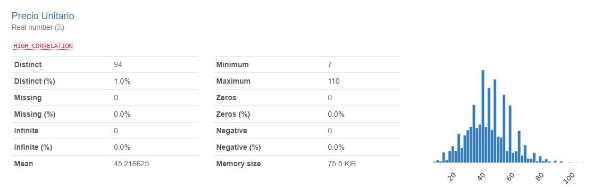
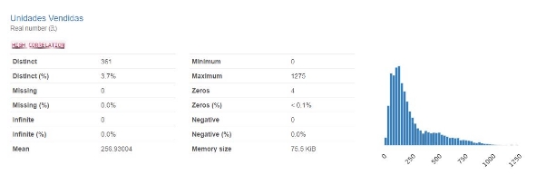
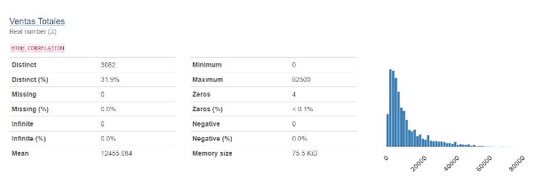
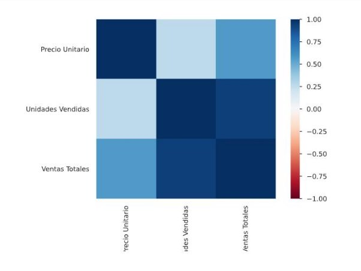
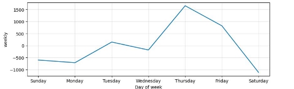
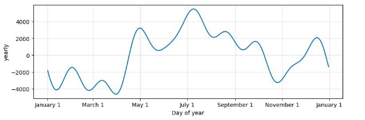
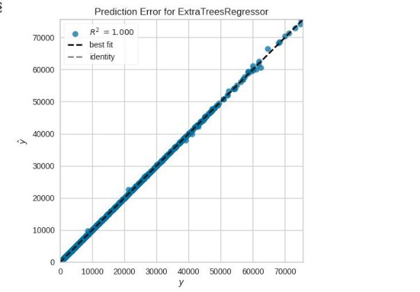



**Walter Nieto &Sol Figueroa Especialistas en IA y BI**

**Análisis de Series de Tiempo Introducción**

Las series de tiempo son un conjunto de datos ordenados cronológicamente, que representan el valor de una variable en diferentes puntos en el tiempo. El análisis de series de tiempo se utiliza para comprender el comportamiento de variables a lo largo del tiempo, identificar patrones y tendencias, y realizar pronósticos futuros.

**Componentes de las Series de Tiempo**

Las series de tiempo se caracterizan por los siguientes componentes:

**Nivel:** Representa el valor promedio de la variable a lo largo del tiempo. **Tendencia:** Representa la dirección general a largo plazo de la variable. **Estacionalidad:** Representa las fluctuaciones cíclicas de la variable, como las variaciones estacionales o mensuales.

**Ruido:** Representa las variaciones aleatorias o impredecibles de la variable.

**Tipos de Series de Tiempo**

Existen diferentes tipos de series de tiempo, que se clasifican según sus características:

**Series de tiempo estacionarias**: Son series de tiempo que no presentan una tendencia o estacionalidad evidente.

**Series de tiempo no estacionarias:** Son series de tiempo que presentan una tendencia o estacionalidad evidente.

**Series de tiempo univariantes:** Son series de tiempo que contienen una sola variable.

**Series de tiempo multivariantes:** Son series de tiempo que contienen dos o más variables.

**Métodos de Análisis de Series de Tiempo**

Hay diferentes métodos para analizar series de tiempo, que se pueden clasificar en dos categorías principales:

**Métodos descriptivos:** Se utilizan para describir las características básicas de la serie de tiempo, como el nivel, la tendencia, la estacionalidad y el ruido.

**Métodos de pronóstico:** Se utilizan para predecir el valor futuro de la variable en un punto específico en el tiempo.

Algunos de los métodos de análisis de series de tiempo más utilizados son:

**Análisis de descomposición:** Descompone la serie de tiempo en sus componentes de nivel, tendencia, estacionalidad y ruido.

**Análisis de autocorrelación:** Evalúa la correlación entre los valores de la serie de tiempo en diferentes momentos.

**Modelado ARIMA:** Utiliza un modelo autoregresivo integrado de media móvil para pronosticar el valor futuro de la variable.

**Modelado GARCH:** Utiliza un modelo de heterocedasticidad autoregresiva condicional generalizada para modelar la variabilidad de los errores en la serie de tiempo.

**Modelado exponencial:** Utiliza modelos que asumen una tasa de descomposición exponencial de la tendencia de la serie temporal.

**Aplicaciones de de Series de Tiempo**

- Economía: Pronóstico de indicadores económicos, como el PIB, la inflación o el desempleo.
- Finanzas: Pronóstico de precios de activos financieros, como acciones, bonos o divisas.
- Marketing: Pronóstico de la demanda de productos o servicios.
- Meteorología: Pronóstico del clima.
- Ingeniería: Monitoreo y control de sistemas de producción.

**Librerías para análisis de series de tiempo en Python**

Existen diversas librerías en Python que facilitan el análisis de series de tiempo. Entre las más populares se encuentran:

1. **Pandas:**

Es una librería fundamental para el manejo y manipulación de datos en Python. Ofrece funciones para cargar datos de diferentes formatos, limpiarlos, preprocesarlos y transformarlos.

Permite crear series de tiempo a partir de datos tabulares.

Brinda herramientas para calcular métricas básicas de las series de tiempo, como la media, la mediana, la desviación estándar y la autocorrelación.

2. **Matplotlib:**

Es una librería para la creación de visualizaciones de datos.

Permite generar gráficos de líneas, barras, dispersión, histogramas y otros tipos de gráficos para visualizar las series de tiempo.

Ofrece opciones para personalizar los gráficos, como el título, las etiquetas, los colores y el estilo de las líneas.

3. **Seaborn:**

Es una librería basada en Matplotlib que facilita la creación de visualizaciones de datos estadísticos.

Ofrece una amplia gama de estilos de gráficos predefinidos y funciones para crear gráficos más complejos.

Permite generar gráficos de series de tiempo con características como la estacionalidad, la tendencia y el ruido.

4. **SciPy:**

Es una librería para el cálculo científico y la computación numérica.

Ofrece funciones para realizar análisis estadísticos de las series de tiempo, como pruebas de hipótesis, análisis de varianza y regresión lineal.

Permite implementar algoritmos de descomposición de series de tiempo, como el análisis de Fourier y el análisis de ondas wavelet.

5. **Statsmodels:**

Es una librería especializada en el modelado estadístico de datos.

Ofrece una amplia gama de modelos para el análisis de series de tiempo, como ARIMA, GARCH y modelos exponenciales.

Permite estimar los parámetros de los modelos, evaluar su ajuste a los datos y realizar pronósticos futuros.

6. **Prophet:**

Es una librería desarrollada por Facebook para el pronóstico de series de tiempo con estacionalidad.

Se basa en un modelo aditivo que separa la tendencia de la estacionalidad de la serie de tiempo.

Es fácil de usar y ofrece buenos resultados en series de tiempo con estacionalidad clara.

7. **Hyndman-Robson:**

Es una librería que implementa los métodos de descomposición de series de tiempo desarrollados por Rob Hyndman y Scott Robson.

Permite realizar análisis de descomposición aditiva, multiplicativa y de tendencia local.

Ofrece funciones para identificar y estimar los componentes de nivel, tendencia, estacionalidad y ruido de la serie de tiempo.

8. **PyTSA:**

Es una librería especializada en el análisis de series de tiempo financieras.

Ofrece funciones para calcular indicadores técnicos, como el RSI, el MACD y las medias móviles.

Permite realizar análisis de volatilidad y detectar patrones en los precios de activos financieros.

9. **TensorFlow:**

Es una librería para el desarrollo de redes neuronales artificiales.

Se puede utilizar para crear modelos de pronóstico de series de tiempo basados en redes neuronales recurrentes, como LSTM o GRU.

Ofrece un alto grado de flexibilidad y personalización para el modelado de series de tiempo complejas.

10. **GluonTS:**

Es una librería basada en TensorFlow para el análisis de series de tiempo.

Ofrece una amplia gama de modelos de pronóstico predefinidos, como modelos autoregresivos, modelos de redes neuronales recurrentes y modelos de transformación.

Permite entrenar, evaluar y desplegar modelos de pronóstico de series de tiempo de manera eficiente.

11. **AutoML Time Series:**

Es una librería de Google Cloud Platform para el pronóstico automático de series de tiempo.

Utiliza técnicas de aprendizaje automático para seleccionar el modelo más adecuado para la serie de tiempo y realizar pronósticos precisos.

Es una solución fácil de usar para aquellos que no tienen experiencia en el modelado de series de tiempo.

**Técnicas de análisis**

El análisis de series de tiempo implica varias técnicas para analizar y modelar datos que se ordenan cronológicamente.

1. **Análisis Descriptivo:**

Objetivo: Comprender las características básicas de la serie temporal.

Técnicas: Trazar datos de series de tiempo, calcular estadísticas resumidas, examinar tendencias y estacionalidad.

2. **Suavización (Smoothing):**

Objetivo: Eliminación de ruido y resaltar las tendencias subyacentes. Técnicas: Promedios móviles, suavizado exponencial.

Simple Exponential Smoothing (Suavizado Exponencial Simple):

En el **suavizado exponencial simple**, se asigna un peso exponencial decreciente a las observaciones anteriores. La fórmula básica para la predicción en el tiempo t+1 se calcula teniendo en cuenta la observación actual (yt) y la predicción anterior (Ft): Ft+1=α⋅yt+(1−α)⋅Ft 

Donde α es el factor de suavizado (0 < α < 1).

**Double Exponential Smoothing (Suavizado Exponencial Doble):**

También conocido como Holt's method, el suavizado exponencial doble se utiliza cuando hay una tendencia en los datos. Además de tener en cuenta la observación actual y la predicción anterior, también se modela y suaviza la tendencia. La fórmula para el suavizado exponencial doble es: Ft+1=α⋅yt+(1−α)⋅(Ft+Tt) Tt+1=β⋅(Ft+1−Ft)+(1−β)⋅Tt 

Donde α y β son los factores de suavizado para la observación y la tendencia, respectivamente.

**Triple Exponential Smoothing (Suavizado Exponencial Triple):**

También conocido como el método de Winter, el suavizado exponencial triple se utiliza cuando hay una estacionalidad en los datos. Además de tener en cuenta la observación actual y la tendencia, también se modela y suaviza la estacionalidad. La fórmula para el suavizado exponencial triple es: Ft+1=α⋅St−Lyt+(1−α)⋅(Ft+Tt) Tt+1=β⋅(Ft+1−Ft)+(1−β)⋅Tt St+1=γ⋅Ft+1yt+(1−γ)⋅St−L 

Donde α, β, y γ son los factores de suavizado para la observación, la tendencia y la estacionalidad, respectivamente. Además, L representa la longitud del ciclo estacional.

Estos métodos de alisado exponencial son útiles para prever valores futuros en series temporales, y la elección del método dependerá de las características específicas de los datos, como la presencia de tendencias y estacionalidades.

3. **Descomposición:**

Objetivo: Dividir una serie de tiempo en sus componentes (tendencia, estacionalidad, residuos).

Técnicas: Descomposición estacional de series temporales

4. **Pruebas de Estacionaridad:**

Objetivo: *Asegurarse de que las propiedades estadísticas de las series temporales no cambien con el tiempo.*

Técnicas: Prueba de Dickey-Fuller aumentada (ADF), prueba de Kwiatkowski-Phillips-Schmidt-Shin (KPSS).

5. **Promedio Móvil Integrado Autorregresivo (ARIMA) Modelos:**

Objetivo: Modelar datos de series de tiempo en función de sus valores pasados y errores de predicción pasados.

Técnicas: El modelado ARIMA implica seleccionar órdenes (p, d, q) en función de la autocorrelación y los gráficos de autocorrelación parcial.

6. **Descomposición Estacional de Series de Tiempo (STL):**

Objetivo: Descomponer series temporales en componentes estacionales, de tendencia y residuos.

Técnicas: Descomposición usando regresión local y filtrado.

7. **Modelos Espaciales de Suavización Exponencial (ETS):**

Objetivo: Modelar datos de series de tiempo basados en suavizado exponencial. Técnicas: Modelos ETS(A, A, N), ETS(A, M, N), donde A representa aditivo y M representa estacionalidad multiplicativa.

8. **Modelos SARIMA (Seasonal ARIMA) :**

Objetivo: Extender los modelos ARIMA para tener en cuenta la estacionalidad. Técnicas: Incorporar diferencias estacionales además de diferencias regulares en los modelos ARIMA.

9. **Prophet:**

Objetivo: Herramienta de pronóstico de series de tiempo diseñada para datos comerciales con observaciones diarias.

Técnicas: Desarrollado por Facebook, Prophet puede manejar datos faltantes, vacaciones y estacionalidad.

10. **Redes de Memoria Larga a Corto Plazo (LSTM) :**

Objetivo: Utilizar el aprendizaje profundo para el pronóstico de series de tiempo, adecuado para capturar patrones complejos.

Técnicas: Las redes LSTM son un tipo de red neuronal recurrente (RNN) diseñada para el modelado de secuencias.

11\.**Modelos GARCH (Generalized Autoregressive Conditional Heteroskedasticity)** :

Objetivo: Modelo de volatilidad variable en el tiempo.

Técnicas: Adecuado para series de tiempo financieras para capturar niveles cambiantes de volatilidad a lo largo del tiempo.

**12. Análisis de Correlación Cruzada:**

Objetivo: Examinar la relación entre dos series de tiempo.

Técnicas: Funciones de correlación cruzada (CCF), gráficos de retardo.

**Análisis de las ventas de ADIDAS**

El set de datos fue sacado de Kaggle [Adidas Sales || EDA | Kaggle](https://www.kaggle.com/code/ahmedabbas757/adidas-sales-eda)

El conjunto de datos de ventas de Adidas es una colección de datos que incluye información sobre las ventas de productos Adidas. Este tipo de conjunto de datos puede incluir detalles como la cantidad de unidades vendidas, los ingresos totales por ventas, la ubicación de las ventas, el tipo de producto vendido y cualquier otra información relevante.

**Variables**

**Minorista:** Representa a la empresa o individuo que vende productos Adidas directamente a los consumidores.

**ID de minorista:** un identificador único asignado a cada minorista en el conjunto de datos.

**Fecha de factura:** la fecha en la que se realizó una factura o transacción de venta en particular.

**Región:** Se refiere a un área geográfica o distrito específico donde se produce la actividad de ventas u operaciones minoristas.

**Estado:** Representa una división administrativa o territorio específico dentro de un país.

**Ciudad:** Se refiere a una zona urbana o municipio donde se realiza la actividad de ventas u operaciones minoristas.

**Producto:** Representa la clasificación o agrupación de productos Adidas.

**Precio por unidad:** El costo o precio asociado con una sola unidad de un producto.

**Unidades vendidas:** la cantidad o número de unidades de un producto particular vendidas durante una transacción de venta específica.

**Ventas totales:** los ingresos generales generados por las transacciones de ventas.

**Beneficio operativo:** El beneficio obtenido por el minorista de sus operaciones comerciales normales.

**Método de venta:** El enfoque o canal utilizado por el minorista para vender sus productos o servicios.

Cómo la mayoría del análisis de BI lo abordamos en Power BI, solo nos concentramos en las tendencias de ventas.

**EDA**

[Adidas EDA](https://colab.research.google.com/drive/17FoaaFcNQaC4q4OM4wbbqiJDAzYW1F_P?usp=sharing)

**Análisis Exploratorio de Datos**

El set de datos tiene 9648 filas y 4 variables.

No se verifican valores faltantes, ni valores nulos. Encontramos las variables Fecha de Factura, Precio Unitario, Unidades Vendidas y Ventas Totales, ya que eliminamos las que no iban a servir en este análisis.

Se verifica una alta correlación entre las unidades vendidas y las ventas totales

A continuación se detallan los códigos que se probaron:

**Pycaret series tiempo**

[Adidas Pycaret Series](https://colab.research.google.com/drive/19-0pZbaeyo4SPOirjYYGBxgYcod720rz?usp=sharing)

En Pycaret series de tiempo la utilidad que sacamos de los datos es que nos indica que la serie de tiempo es estacionaria. Las métricas no son adecuadas.

**Smoothing**

[Adidas Suavizados](https://colab.research.google.com/drive/11bjW1yczuhpGgmfUhT0VCc2I0ezTKvj4?usp=sharing)

Se decide probar diferentes modelos econométricos.

Se evaluaron diferentes modelos estadísticos para ajustarse a los datos y realizar predicciones futuras.

1. **Análisis de Normalidad y Estacionariedad**
- **Normalidad:** Se realizó un análisis de normalidad para evaluar si los datos siguen una distribución normal. Los resultados indicaron que los datos *no se ajustan a una distribución normal*, lo que implica que no pueden ser modelados utilizando métodos estadísticos tradicionales que asumen normalidad.
- **Estacionariedad:** Se verificó la estacionaridad de los datos para determinar si son adecuados para el análisis de series de tiempo. Los resultados confirmaron la estacionaridad de los datos, lo que permite aplicar técnicas de modelado de series de tiempo.
2. **Análisis de Autocorrelación y Parcial**
- **ACF y PACF:** Se realizaron análisis de autocorrelación (ACF) y autocorrelación parcial (PACF) para evaluar la influencia de los valores atípicos en la autocorrelación de los datos. Los resultados no mostraron diferencias significativas, lo que indica que los valores atípicos no tienen un impacto significativo en la estructura temporal de los datos.
- **Selección de parámetros ARIMA:** Se seleccionaron los valores p = 6 y q = 1 para el modelo ARIMA (Autoregressive Integrated Moving Average) en base a los análisis de ACF y PACF.
3. **Evaluación de Modelos**
- **ARIMA:** Se aplicó el modelo ARIMA con los parámetros seleccionados, pero se obtuvo una mala métrica de ajuste, lo que llevó a descartar este modelo.
- **Sarimax:** Se probó el modelo SARIMAX (Seasonal Autoregressive Integrated Moving Average with Exogenous Variables) para incorporar posibles efectos estacionales en los datos. Sin embargo, este modelo tampoco proporcionó resultados satisfactorios.
- **GARCH:** Se evaluó el modelo GARCH (Generalized Autoregressive Conditional Heteroskedasticity) para modelar la heterocedasticidad condicional de los datos. Sin embargo, este modelo no es adecuado para realizar predicciones futuras.
- **Modelo Aditivo:** Se verificó que los datos se ajustan mejor a un modelo aditivo, lo que implica que la tendencia y la estacionalidad pueden modelarse por separado.
- **Modelos Exponenciales:** Se probaron diferentes modelos exponenciales para ajustar la tendencia y la estacionalidad de los datos.
- **Suavizado Doble:** El mejor modelo resultó ser el suavizado doble, que combina el suavizado exponencial simple para la tendencia y el suavizado exponencial con amortiguación para la estacionalidad.
4. **Conclusiones**
- Los datos no siguen una distribución normal, lo que requiere el uso de métodos estadísticos no paramétricos o modelos más robustos.
- Los datos son estacionarios y no presentan una autocorrelación significativa, lo que permite aplicar técnicas de modelado de series de tiempo.
- Los modelos ARIMA, SARIMAX y GARCH no fueron adecuados para ajustar los datos o realizar predicciones futuras.
- Los datos se adaptan mejor a un modelo aditivo, donde la tendencia y la estacionalidad se modelan por separado.
- El suavizado doble se identificó como el mejor modelo para ajustar la tendencia y la estacionalidad de los datos, proporcionando un buen ajuste y predicciones precisas.

**Modelo con Prophet**

[Adidas Prophet](https://colab.research.google.com/drive/180vroGH9nemeA4ZsSA1Zg0mHWDiT8XYH?usp=sharing)

**Análisis con Prophet**

Se crea un modelo para predicción de series de tiempo con la librería Prophet.

Se realizan las predicciones.

Se verifica que el modelo encontró que el día de más ventas es el jueves, decayendo bastante los fines de semana. Las ventas muestran una estacionalidad desde Mayo a Noviembre

La evaluación no da buenos resultados.

**Modelos de Ensambles**

[Adidas Ensambles](https://colab.research.google.com/drive/1eCxRJhxTmTBAumxtliCye2N0HRPOxdqn?usp=sharing)

Estas son las métricas obtenidas aplicando granularidades de tiempo

**Métricas de Random Forest**

**Error cuadrático medio (RMSE) - Granularidad diaria: 12444.525918705034** Error cuadrático medio (RMSE) - Granularidad semanal: 3317.0781304821217 Error cuadrático medio (RMSE) - Granularidad mensual: 1814.0508338285997 Error cuadrático medio (RMSE) - Granularidad anual: 2572.6619023229387

**Métricas de XGBoost**

Error cuadrático medio (RMSE) - Granularidad diaria: 12638.468032280642 Error cuadrático medio (RMSE) - Granularidad semanal: 3855.944411924629 Error cuadrático medio (RMSE) - Granularidad mensual: 2882.7529203017966 Error cuadrático medio (RMSE) - Granularidad anual: 2528.2688021592853

**Error cuadrático medio (RMSE) del mejor modelo con términos de regularización ajustados: 12355.604704349038**

**Métricas de Staking**

Error cuadrático medio (RMSE) del modelo de stacking: 12553.680695667152 Stacking de RF y XGBR

**Métricas de AdaBoost**

Error cuadrático medio (RMSE) del modelo AdaBoost: 13974.771357474472

Error cuadrático medio (RMSE) del mejor modelo con GS: 12835.841855673085

**Métricas de LightGBM**

**Error cuadrático medio (RMSE) del modelo LightGBM: 12301.493666225475** Error cuadrático medio (RMSE) del mejor modelo con GS: 12322.380669647637 **Métricas de SVR**

Error cuadrático medio (RMSE) del modelo SVR base: 13757.01056343553 **Métricas de ADABOOST**

Error cuadrático medio (RMSE) del modelo ADABOOST: 13249.21554422838

**El mejor rendimiento lo logramos con LightGBM**

**LSTM**

[Adidas LSTM](https://colab.research.google.com/drive/100LaoJ_7NJ7VNur1MwzwJDUyY-Z993DJ?usp=sharing)

El análisis de series temporales se considera una herramienta clave para comprender y predecir el comportamiento de variables a lo largo del tiempo, como las ventas de una empresa. En este contexto, los modelos de Redes Neuronales Recurrentes, específicamente las Redes (LSTM), se han vuelto populares por su capacidad para capturar la dinámica temporal de los datos.

En este proyecto, se ha entrenado un modelo LSTM con el objetivo de predecir las ventas totales de Adidas en los Estados Unidos. El desempeño del modelo se ha evaluado utilizando métricas como el Error Cuadrático Medio (MSE) y el Coeficiente de Determinación (R²).

Conclusión LSTM

Los resultados obtenidos muestran que el modelo LSTM entrenado para predecir las ventas totales de Adidas en Estados Unidos tiene un desempeño pobre en el conjunto de prueba. Esto se refleja en las métricas de evaluación:

- **Test Loss (MSE):** 1.98e+18. Este valor extremadamente alto indica que el modelo no está siendo capaz de hacer predicciones precisas en el conjunto de prueba.
- **Mean Squared Error (MSE):** 1.98e+18. Un MSE tan alto significa que los errores de predicción son enormes en magnitud.
- **Mean Absolute Error (MAE):** 1,005,014,117.49. Este valor también es muy alto, lo que sugiere que las predicciones del modelo se desvían en promedio en más de 1 millón de unidades monetarias de los valores reales.
- **R-squared (R²):** -1.0457. Un R² negativo indica que el modelo es peor que simplemente usar la media de los valores reales como predicción.

Estos resultados tan pobres se replican incluso en el conjunto de entrenamiento, con una pérdida (MSE) de 2.20e+18 y un R² de -0.94.

Sin embargo, los buenos resultados obtenidos en la validación cruzada, con un MSE promedio de 0.017, muestran que el modelo se ajusta bien a los datos de entrenamiento durante cada fold. Esto sugiere que existe potencial en el enfoque, pero el modelo no está siendo capaz de generalizar adecuadamente a datos nuevos.

Algunas posibles razones para este comportamiento podrían ser:

1. Sobreajuste: Es posible que el modelo se esté sobreajustando a los datos de entrenamiento durante la validación cruzada, pero no esté aprendiendo patrones generalizables.
1. Calidad de los datos: Los altos valores de MSE en el conjunto de prueba pueden indicar problemas con la calidad de los datos, como la presencia de outliers o datos faltantes.
1. Características del modelo: La arquitectura LSTM utilizada quizás no sea la más adecuada para capturar la dinámica temporal de las ventas en este conjunto de datos.
1. Escalado de los datos: El escalado inicial de los datos podría no haber sido el más apropiado para este problema.

Para mejorar el rendimiento del modelo, se recomienda revisar a fondo la calidad de los datos, probar diferentes técnicas de preparación de los datos (escalado, selección de características, etc.) y explorar otras técnicas de modelado de series de tiempo, como modelos clásicos (ARIMA, exponencial suavizado) o enfoques más avanzados (redes neuronales recurrentes bidireccionales).

**Pycaret para regresión**

[Adidas Pycaret Regresion](https://colab.research.google.com/drive/10yujcz5Q83zrJtGfxJD_lKWKFfi4jnt1?usp=sharing)

Se le pide a Pycaret hacer un preprocesamiento y normalización de datos.

- El algoritmo Extra Trees (árboles extremadamente aleatorios) es una técnica de aprendizaje automático que pertenece a la familia de los métodos de ensamble de árboles de decisión. Es una variante del algoritmo Random Forest.
- Extra Trees se diferencia de Random Forest en dos aspectos principales: utiliza una construcción de árbol completamente aleatoria y los árboles pueden no crecer completamente.
- En Extra Trees, se seleccionan umbrales aleatorios para cada característica y se elige el mejor umbral, lo que hace que los árboles se construyan de manera más aleatoria que en Random Forest.
- Los árboles en Random Forest siempre se construyen completamente, mientras que en Extra Trees los árboles pueden dejar de crecer antes de desarrollarse completamente. Esto hace que Extra Trees sea computacionalmente más ligero.
- La aleatoriedad adicional en la construcción del árbol y el uso de umbrales aleatorios para la división hace que Extra Trees sea más rápido de entrenar que Random Forest.
- Extra Trees puede tener una ligera pérdida en precisión predictiva en comparación con Random Forest, pero las pruebas mostraron que las métricas del modelo eran satisfactorias sin necesidad de mayor precisión.

  Con este algoritmo se encuentran métricas muy prometedoras

1. MAE (Error absoluto medio): El error absoluto medio indica cuánto varían las predicciones del valor real en promedio. En este caso, el MAE es de 36.3463, lo que significa que, en promedio, las predicciones están desviadas en aproximadamente 36.35 unidades del valor real.
1. MSE (Error cuadrático medio): El error cuadrático medio es una medida de la magnitud promedio de los errores cuadráticos entre las predicciones y los valores reales. Aquí, el MSE es de 25832.58, lo que significa que el cuadrado promedio de las diferencias entre las predicciones y los valores reales es de aproximadamente 25832.58.
1. RMSE (Error cuadrático medio raíz): El RMSE es simplemente la raíz cuadrada del MSE y proporciona una idea de la magnitud de los errores en la misma unidad que los valores originales. Con un valor de 154.6398, indica que las predicciones están desviadas en promedio en aproximadamente 154.64 unidades del valor real.
1. R cuadrado (coeficiente de determinación): El coeficiente de determinación indica qué tan bien se ajustan las predicciones a los valores reales. Con un valor de 0.998, casi todo el poder explicativo del modelo explica la variabilidad de los datos, lo que indica un muy buen ajuste del modelo a los datos.
5. RMASLE (Error cuadrático medio absoluto de los errores de registro): Esta métrica es similar al RMSE, pero se calcula en el espacio logarítmico. Un valor de 0.0455 indica que las predicciones están desviadas en promedio en aproximadamente 0.0455 unidades del logaritmo del valor real.
5. MAPE (Error porcentual absoluto medio): El MAPE es una medida del error porcentual entre las predicciones y los valores reales. Con un valor de 0.0043, indica que, en promedio, las predicciones tienen un error absoluto del 0.43%.

El modelo tiene un buen desempeño en términos de precisión y ajuste a los datos, con errores relativamente bajos y un alto coeficiente de determinación.

Se opta por seleccionar este modelo y dejarlo listo para producción.
